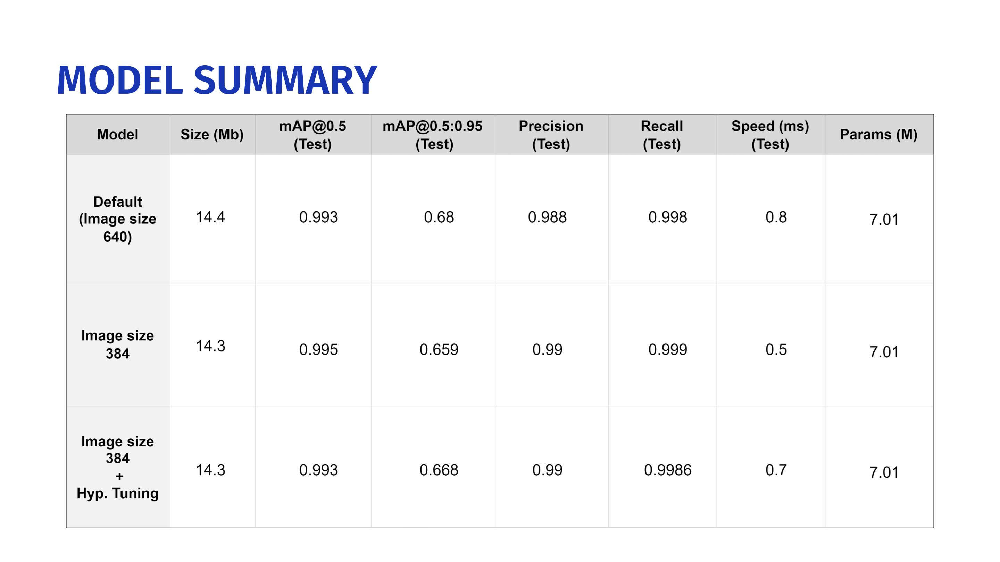
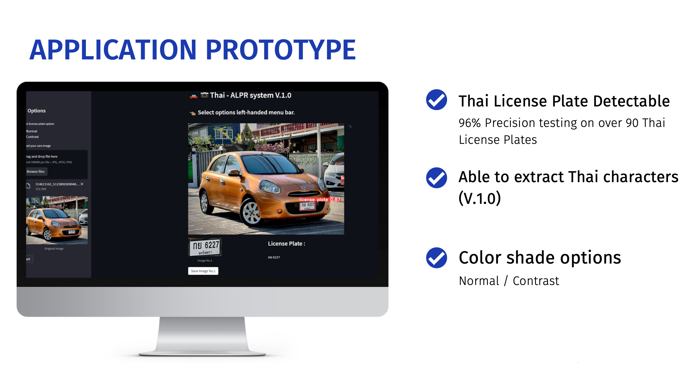
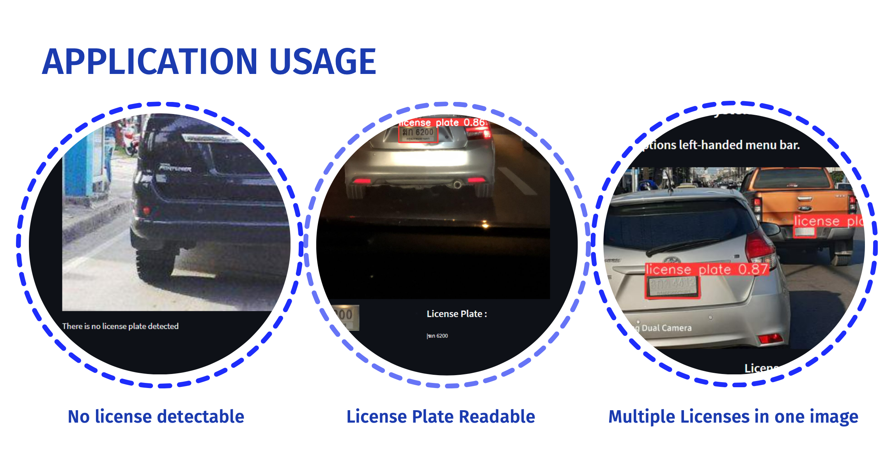

# CAPSTONE : THAI Automatic License Plate Recognition (ALPR) 

### Contents:
- [Problem Statement](#Problem-Statement)
- [Executive Summary](#Executive-Summary)
- [Conclusions and Recommendations](#Conclusions-and-Recommendations)
- [Further Improvements](#Further-Improvements) 

### Problem Statement 

The increasing of cumulative number of cars in every years may cause the difficulty to manage and control each car thoroughly. Should it be better to have system that can help either orginization or society to maintain the congestion of cars. Also, ALPR system can be used as toll payment system, parking system, parking entrance, etc.

### Installation :
- Simply run the command below to install the necessary packages

```
pip install -r requirements.txt
```


### Usage : 
1. Clone this repository and install the requirements package
2. Navigate to this directory and run the command : 
```
streamlit run app.py
```

### Approach :  
To create THAI ALPR Model due to the limitation of Thai license plate dataset
- Gather the images from **Roboflow** and  **Kaggle** > 1000 images with the label files
- This project use YOLOv5 to train the model and EasyOCR to segment the characters from the license plate which is only allow 'TH' language in this project.
- Using Opencv to offer the color shade options as user preferences.
- Creating Streamlit web application

From the developing of model section, give out these model option :


<p align="center"></p>


### Streamlit APP

<p align="center"></p>

<p align="center"></p>


 

### Conclusions and Recommendations

**Model summary**
- Yolov5s, epochs = 250, batch = 16, image size = 384 pixels Parameters : 7.01 M, Speed (ms) = 0.5, Size = 14.3 Mb

**Performance of model**
- Detect license plates from **International** test set : Precision = 0.988, Recall = 0.98
- Detect license plates from **Thai** test set : Precision = 0.96, Recall = 0.90